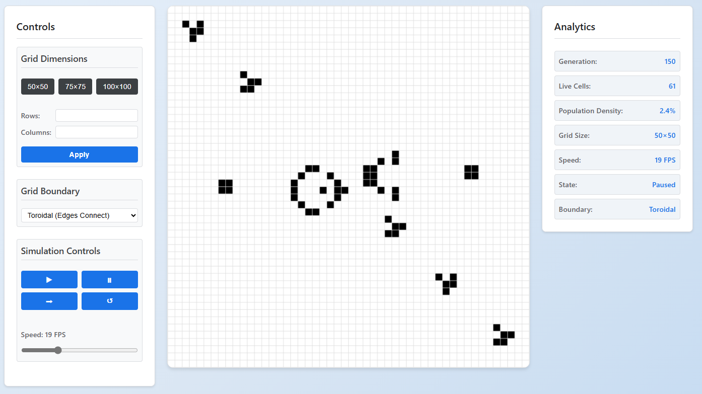

# Game of Life Simulator

An interactive web-based implementation of Conway's Game of Life built with HTML5 Canvas and JavaScript. Experience the fascinating world of cellular automata through this modern, responsive simulator.



## Features

- **Interactive Grid**: Click or tap to toggle cells between alive and dead states
- **Simulation Controls**:
  - Start/Pause simulation
  - Step through generations manually
  - Reset grid to initial state
  - Adjustable simulation speed (1-60 FPS)
- **Pattern Library**:
  - Still Life patterns (Block, Beehive, Boat, Loaf)
  - Oscillators (Blinker, Toad, Pulsar)
  - Spaceships (Glider, Lightweight Spaceship)
  - Growth patterns (R-Pentomino, Gosper Glider Gun)
- **Grid Settings**:
  - Adjustable grid size (preset: 50×50, 75×75, 100×100)
  - Custom grid dimensions support
  - Toroidal or finite boundary options
- **Real-time Analytics**:
  - Generation counter
  - Live cell count
  - Population density
  - Current grid size
  - Simulation speed
  - Boundary type
- **Responsive Design**:
  - Works on desktop and mobile devices
  - Touch-friendly interface
  - High-DPI display support

## Quick Start

1. Clone the repository:
   ```bash
   git clone https://github.com/AntonioAI/game-of-life-simulator.git
   cd game-of-life-simulator
   ```

2. Open `index.html` in your web browser

The grid will be pre-populated with the R-Pentomino pattern, ready to demonstrate the fascinating evolution of Conway's Game of Life.

## Usage

1. **Grid Interaction**:
   - Click/tap any cell to toggle it between alive (filled) and dead (empty)
   - Use the Pattern Library to place pre-defined patterns

2. **Controls**:
   - ▶ (Play): Start the simulation
   - ⏸ (Pause): Pause the simulation
   - ➡ (Step): Advance one generation
   - ↺ (Reset): Clear the grid
   - Speed slider: Adjust simulation speed from 1 to 60 FPS

3. **Grid Settings**:
   - Choose from preset grid sizes (50×50, 75×75, 100×100)
   - Enter custom dimensions (10-200 cells per side)
   - Toggle between toroidal (wrapping) and finite boundaries

## Technical Details

- Built with vanilla JavaScript and HTML5 Canvas
- No external dependencies
- Optimized for performance with:
  - RequestAnimationFrame for smooth animation
  - Batch rendering operations
  - Efficient grid computation
  - Mobile-specific optimizations

## Browser Support

Tested and working on:
- Chrome (latest)
- Firefox (latest)
- Safari (latest)
- Edge (latest)
- Mobile browsers (iOS Safari, Chrome for Android)

## Contributing

Contributions are welcome! Please feel free to submit a Pull Request.

## License

Copyright (c) 2025 Antonio Innocente. All rights reserved.

## Terms of Service

By accessing or using this website, you agree to the following terms:

1. **Copyright and Attribution**: This website and its source code are the property of Antonio Innocente and is protected by copyright law. You may not copy, modify, or distribute the content without prior written permission.
2. **Monetization**: We may display advertisements on the website to support its operation and development.
3. **Permitted Use**: You may use the website for personal and research purposes.
4. **User Data and Privacy**: In the future, we may collect and store user data, such as usernames and game statistics, to facilitate community features. Any data collected will be handled in accordance with our Privacy Policy.
5. **User-Generated Content**: If community features are added, users will retain ownership of any content they create on the website (e.g., custom patterns or challenges), but grant us a license to use, display, and modify that content for the purposes of operating the website.
6. **Disclaimer of Warranties**: The website is provided "as is" without any warranties, express or implied.
7. **Limitation of Liability**: We are not liable for any damages arising from the use of the website.
8. **Modifications**: We reserve the right to modify these terms at any time. Continued use of the website after changes constitutes acceptance of the modified terms.